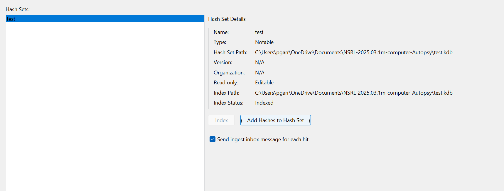
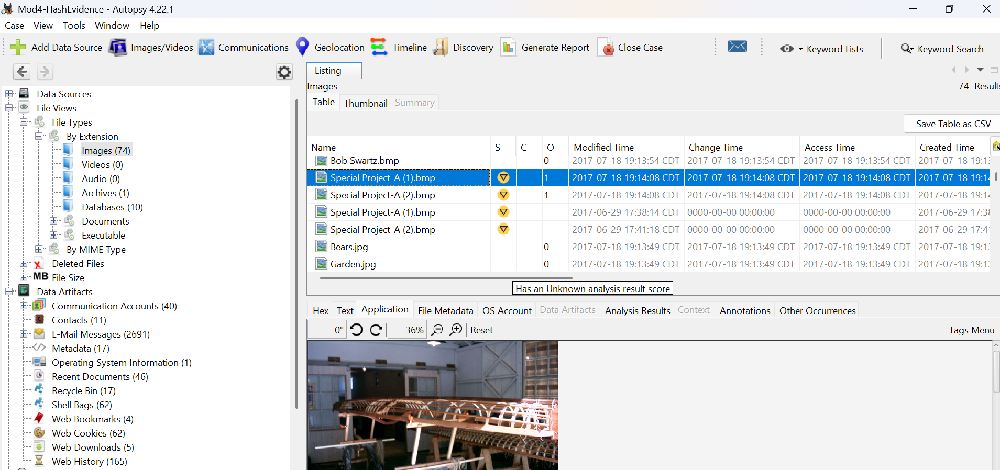
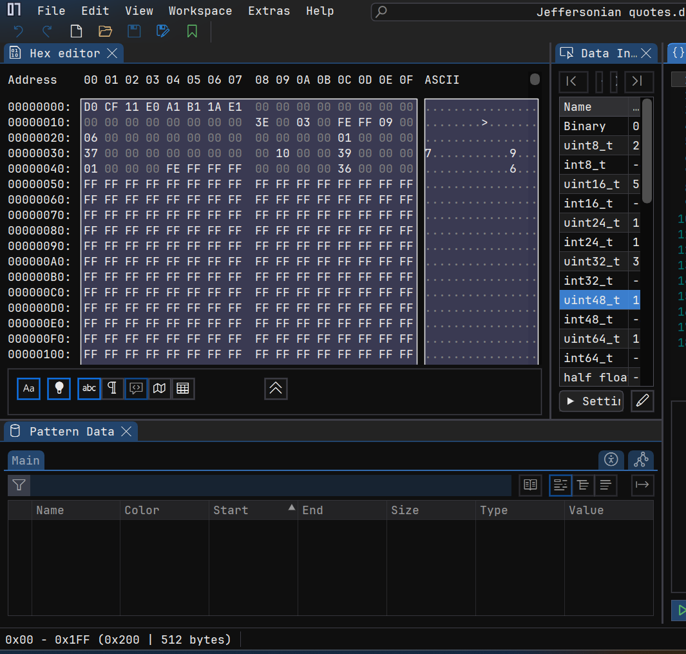
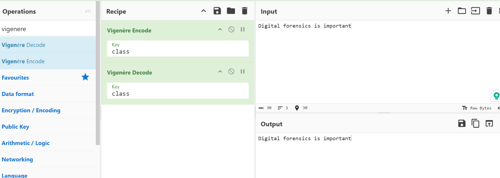

# df-mod4-tools
## Exercise 1 - Hash Database Import

This shows the imported NSRL hash database in Autopsy.

## Exercise 2 - Evidence Hash Database

This shows tagged files and the created hash database of notable evidence.

## Exercise 3 - Hex / Hash Analysis

This shows the SHA-256 hash generated from the file.

## Exercise 4 - Encryption (CyberChef)

This shows encoding and decoding using Vigenère cipher.
